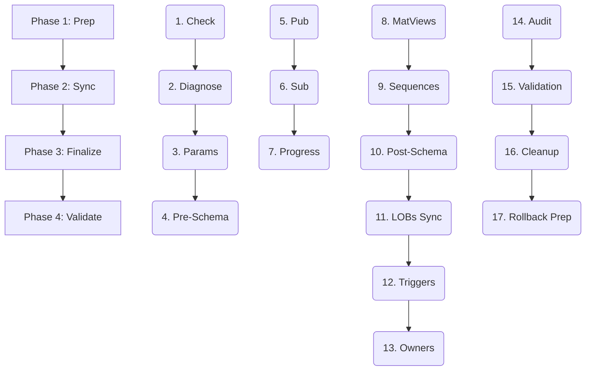

# Standardized 17-Step Workflow

**pg_logical_migrator** follows a strictly defined sequential workflow. Each step is designed to be independent, repeatable, and verifiable.

### 🧪 Phase 1: Preparation (Pre-flight)

1.  **Check Connectivity (`check`)**: Verify orchestrator reachability to both source and destination instances.
2.  **Diagnostics (`diagnose`)**: Scan for Primary Key coverage, Large Objects (LOBs), and unowned sequences.
3.  **Parameter Verification (`params`)**: Confirm mandatory settings (`wal_level=logical`, slots, workers).
4.  **Schema (Pre-Data) (`migrate-schema-pre-data`)**: Deploy base structures (schemas, tables, types, views).

### ⚡ Phase 2: Execution (Data Sync)

5.  **Setup Publication (`setup-pub`)**: Define the replication scope on the source.
6.  **Setup Subscription (`setup-sub`)**: Trigger initial data COPY and start logical change streaming.
7.  **Monitor Progress (`repl-progress`)**: Track byte-level and table-level synchronization status.

### 🏁 Phase 3: Finalization (Cutover Ready)

8.  **Refresh Materialized Views (`refresh-matviews`)**: Manually refresh non-replicated data in matviews.
9.  **Sync Sequences (`sync-sequences`)**: Align sequence values to prevent ID collisions after cutover.
10. **Schema (Post-Data) (`migrate-schema-post-data`)**: Create indexes, foreign keys, and constraints.
11. **Large Object Sync (`sync-lobs`)**: Manually migrate binary data (OIDs) and update table references.
12. **Enable Triggers (`enable-triggers`)**: Restore application-level trigger logic on the target.
13. **Reassign Ownership (`reassign-owner`)**: Set correct role owners for all database objects.

### 🛡️ Phase 4: Validation & Cleanup

14. **Object Audit (`audit-objects`)**: Verify structural parity (counts of tables, indexes, views).
15. **Row Count Parity (`validate-rows`)**: Final check of data consistency across all tables.
16. **Cleanup (`cleanup`)**: Decommission replication slots and publication objects.
17. **Reverse Replication (`setup-reverse`)**: (Optional) Prepare a rollback path to sync changes back to source.

---

### 📊 Workflow Summary

---

### 🚀 Automated Pipelines

Instead of running the 17 steps manually, `pg_logical_migrator` provides two macro-commands (pipelines) that bundle these steps for automated CI/CD workflows:

#### 1. Initialization Pipeline (`init-replication`)
Executes **Phase 1** and **Phase 2**:
- `check`
- `diagnose`
- `params`
- `migrate-schema-pre-data`
- `setup-pub`
- `setup-sub`

*Result: Replication is active and data is syncing in the background.*

#### 2. Cutover Pipeline (`post-migration`)
Executes **Phase 3** and **Phase 4**:
- `post-sync` (Stops replication)
- `migrate-schema-post-data`
- `sync-sequences`
- `refresh-matviews`
- `reassign-owner`
- `enable-triggers`
- `sync-lobs`
- `audit-objects`
- `validate-rows`
- `cleanup`

*Result: The target database is fully independent, verified, and ready for production traffic.*
