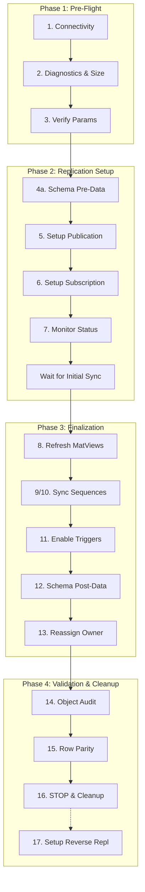

# Migration Workflow — 16 Steps

The `pg_logical_migrator` operates through a predefined **16-step sequence** to ensure data integrity and minimal downtime.

---

## High-Level Pipeline



---

## Detailed Step Reference

### Phase 1 — Pre-Flight Checks

#### 1. Connectivity Check
- **Purpose**: Verify network and auth for both servers.
- **CLI**: `pg_migrator.py check`

#### 2. Diagnostics & Size Analysis
- **Purpose**: Scan for blockers (missing PK, LOBs) and audit database/table sizes.
- **CLI**: `pg_migrator.py diagnose`

#### 3. Parameter Verification
- **Purpose**: Ensure `wal_level = logical` and enough slots/workers.
- **CLI**: `pg_migrator.py params`

---

## Phase 2 — Replication Setup

#### 4a. Schema Pre-Data Migration
- **Purpose**: Create tables and structures on destination.
- **CLI**: `pg_migrator.py migrate-schema-pre-data`

#### 5. Source Replication Setup
- **Purpose**: Create Publication. Handles `REPLICA IDENTITY FULL` for no-PK tables.
- **CLI**: `pg_migrator.py setup-pub`

#### 6. Destination Replication Setup
- **Purpose**: Create Subscription and start background data copy.
- **CLI**: `pg_migrator.py setup-sub`

#### 7. Replication Monitoring
- **Purpose**: Watch real-time sync status and byte-level progress.
- **CLI**: `pg_migrator.py repl-status` or `repl-progress`

---

## Phase 3 — Finalization

#### 8. Materialized Views Refresh
- **Purpose**: Sync non-replicated views.
- **CLI**: `pg_migrator.py refresh-matviews`

#### 9/10. Sequence Synchronization
- **Purpose**: Apply current sequence values to avoid ID collisions.
- **CLI**: `pg_migrator.py sync-sequences`

#### 11. Trigger Activation
- **Purpose**: Re-enable triggers on destination.
- **CLI**: `pg_migrator.py enable-triggers`

#### 12. Schema Post-Data Migration
- **Purpose**: Create indexes and foreign keys after data is synced.
- **CLI**: `pg_migrator.py migrate-schema-post-data`

#### 13. Reassign Ownership
- **Purpose**: Set correct owner for all migrated objects.
- **CLI**: `pg_migrator.py reassign-owner`

---

## Phase 4 — Validation & Cleanup

#### 14. Object Audit
- **Purpose**: Verify structural parity (counts of tables, views, etc.).
- **CLI**: `pg_migrator.py audit-objects`

#### 15. Data Validation (Row Parity)
- **Purpose**: Confirm 100% data consistency.
- **CLI**: `pg_migrator.py validate-rows [--use-stats]`

#### 16. STOP / CLEANUP
- **Purpose**: Finalize and free resources (Drop Sub/Pub).
- **CLI**: `pg_migrator.py cleanup`

#### 17. Setup Reverse Replication (Optional)
- **Purpose**: Create a reverse logical replication stream (Destination -> Source) to allow immediate rollback after cutover.
- **CLI**: `pg_migrator.py setup-reverse`

---

## Automated Pipelines

### A. Initialization (`init-replication`)
Executes steps 1 to 6, waits for sync, then runs validation (14, 15).

```mermaid
listStream
    Step 1 --> Step 2
    Step 2 --> Step 3
    Step 3 --> Step 4a
    Step 4a --> Step 5
    Step 5 --> Step 6
    Step 6 --> Wait_Sync
    Wait_Sync --> Step 14
    Wait_Sync --> Step 15
```

### B. Post Migration (`post-migration`)
Waits for final sync, then executes steps 16, 12, 8, 9/10, 11, 13 and final validation.

```mermaid
listStream
    Wait_Sync --> Step 16
    Step 16 --> Step 12
    Step 12 --> Step 8
    Step 8 --> Step 9/10
    Step 9/10 --> Step 11
    Step 11 --> Step 13
    Step 13 --> Step 14
    Step 13 --> Step 15
```

[Return to Documentation Index](README.md)
