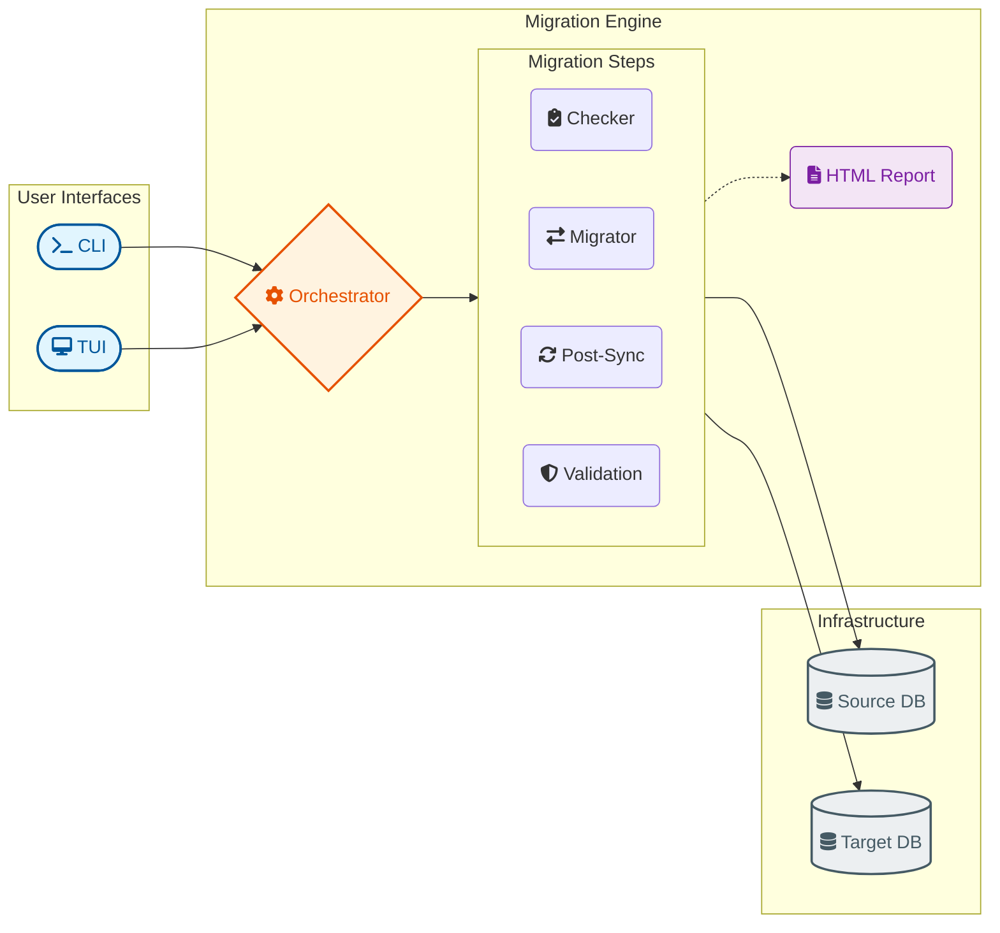

# pg_logical_migrator

[](https://www.postgresql.org/)
[](https://www.python.org/)
[](LICENSE)
[](https://hub.docker.com/r/jmrenouard/pg_logical_migrator)
[](https://buymeacoffee.com/jmrenouard)

**pg_logical_migrator** is a Python-based orchestrator designed to automate PostgreSQL database migrations using **logical replication**. It provides a standardized **17-step sequential workflow**, a refactored **centralized TUI dashboard**, and automated pipelines for complex infrastructure migrations.

---

## 🎥 Lifecycle Demonstration

Watch how **pg_logical_migrator** orchestrates an end-to-end database migration, including **Large Object (LOB) synchronization** and real-time parity audits.

[](https://asciinema.org/a/2XCuo1WYnRZZfo5o)

---

## Key Features

- **Standardized 17-Step Workflow**: A strictly defined, repeatable process ensuring maximum data integrity.
- **Refactored TUI Dashboard**: A modern, result-centric interface with action tabs and an **interactive action history**.
- **Large Object (LOB) Synchronization**: Manually migrates binary data (OIDs) and restores table references.
- **Deep Pre-flight Diagnostics**: Scans for Primary Key coverage, LOBs, and unowned sequences.
- **Replication Byte-level Tracking**: Real-time progress monitoring of the initial data copy.
- **Post-Migration Parity Audits**: Structural parity checks and exhaustive row count comparison.
- **Automated Rollback Path**: Integrated setup for reverse replication to sync changes back to the source.
- **Audit-Ready HTML Reports**: Detailed visual reports containing every executed SQL command and its output.

---

## Architecture at a Glance



---

## Deployment Options

### Option A — Docker (Recommended)
The official image ships with all dependencies pre-installed. No local Python configuration is required.

```bash
docker pull jmrenouard/pg_logical_migrator:latest
```

### Option B — Local Python Setup
For local development, ensure you have Python 3.9+ and the required drivers.

```bash
git clone https://github.com/jmrenouard/pg_logical_migrator
pip install -r requirements.txt
```

---

## Quick Start (3 Steps)

### 1. Configure Connection Parameters
Create a `config_migrator.ini` file based on the provided sample. Ensure both databases are reachable and have `wal_level = logical`.

### 2. Initialize Replication
Start the initial data copy and streaming delta.
```bash
python pg_migrator.py init-replication --drop-dest
```

### 3. Finalize Cutover
Once synchronization is complete, finalize the schema, sequences, and triggers.
```bash
python pg_migrator.py post-migration
```

---

## Documentation Index

| Resource | Description |
| :--- | :--- |
| **[DOCS/WORKFLOW.md](DOCS/WORKFLOW.md)** | **Standardized 16-Step Sequence** with technical deep-dives. |
| **[DOCS/CONFIGURATION.md](DOCS/CONFIGURATION.md)** | `config_migrator.ini` reference and PG parameters. |
| **[DOCS/LIMITATIONS.md](DOCS/LIMITATIONS.md)** | Critical constraints (PK, LOBs, DDL restrictions). |
| **[DOCS/DOCKER.md](DOCS/DOCKER.md)** | Running within isolated containerized environments. |
| **[DOCS/README.md](DOCS/README.md)** | **Complete Documentation Hub**. |

---

## 🔒 Security & Support

- **Vulnerability Reporting**: Please refer to [SECURITY.md](SECURITY.md) for our responsible disclosure policy.
- **Contributions**: Guidelines for submitting PRs and bug reports are in [CONTRIBUTING.md](CONTRIBUTING.md).

---

## 📬 Contact Me

| Channel | Link |
| :--- | :--- |
| 🌐 Website | [www.jmrenouard.fr](https://www.jmrenouard.fr) |
| 💼 LinkedIn | [jmrenouard](https://www.linkedin.com/in/jmrenouard) |
| 🐦 X (Twitter) | [@jmrenouard](https://x.com/jmrenouard) |
| 🐙 GitHub | [jmrenouard](https://github.com/jmrenouard) |

---

## License

MIT License. See [LICENSE](LICENSE) for details.
